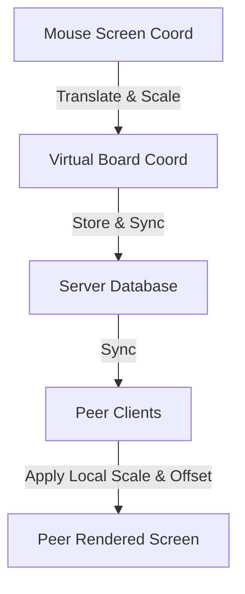

# Design Proposal: Canvas Background & Element Alignment

During screen resizing, sidebar toggling, or when users with different screen sizes collaborate, the background image scales dynamically (via fit/cover rules) while placed elements remain anchored to absolute canvas screen pixels. This proposal details 4 options to resolve this alignment mismatch.

---

## The Problem

Currently, `Canvas.jsx` uses a `ResizeObserver` to set the HTML `<canvas>` resolution equal to its parent container's dimensions.
* **Background Image**: Scaled and centered inside the canvas viewport according to the selected background mode (`cover`, `fit`, `stretch`). When the canvas resizes (e.g., sidebars toggle), the background scales and its origin $(X_{bg}, Y_{bg})$ shifts.
* **Placed Elements**: Positioned at absolute canvas pixel coordinates $(x, y)$. When the canvas resizes, they remain anchored to $(x, y)$ relative to the top-left of the canvas DOM element.
* **Result**: Relative alignment between elements and the background image is broken. For example, a pin placed on a specific room of a floorplan background will float away when a panel is opened or closed.

```
Initial State (Sidebar Expanded):
+-----------------------------------+
|  Header                           |
+--------+--------------------------+
|        | Canvas (1000px)          |
| Left   |   +------------------+   |
| Panel  |   | Background Image |   |
| (320px)|   |   * [Pin @ Room] |   |
|        |   +------------------+   |
+--------+--------------------------+

After Sidebar Collapse (Canvas expands to 1320px):
+-----------------------------------+
|  Header                           |
+-----------------------------------+
| Canvas (1320px)                   |
|   +----------------------+        |
|   | Background Image     |        |
|   | (SCALED & SHIFTED)   |        |
|   |      * [Room here]   |        |
|   +----------------------+        |
|   * [Pin remains at old x,y]      | <-- ALIGNMENT BROKEN!
+-----------------------------------+
```

---

## Proposed Options

### Option A: Virtual Coordinate Artboard (Auto-Scaled Virtual Space)
Define a fixed virtual bounding box (an "artboard") representing the board's coordinate system (e.g., matching the background image's native resolution, or a default 1920x1080 if no background exists).
* **Rendering**: In `drawCanvas()`, we compute the uniform scale and offsets to center and fit this virtual box inside the physical screen canvas. We apply `ctx.translate(offsetX, offsetY)` and `ctx.scale(scale, scale)`. Both the background image and all elements are then drawn in virtual space.
* **Inputs**: The mouse coordinate mapper `getCanvasCoords(e)` translates screen client coordinates to virtual coordinates: $X_{virtual} = (X_{screen} - X_{offset}) / \text{scale}$.
* **Real-time Cursors**: Users broadcast their virtual coordinates. Other clients render cursors by converting them back to their local screen coordinates.



* **Pros**:
  * **Perfect UX**: The background and elements scale up/down and shift in perfect unison. Opening/closing sidebars smoothly shrinks/grows the board like a slide, maintaining all annotations on target.
  * **Cross-Device Consistency**: A user on a small laptop and another on a large monitor see the identical layout and relative placements.
* **Cons**:
  * Requires refactoring mouse click, dragging, resizing, drawing, and path-erasure coordinates in `Canvas.jsx` to execute in virtual space.

---

### Option B: Zoom & Pan Viewport (Full Camera System)
Treat the canvas as an infinite board, introducing a local camera view state: `zoom` (number) and `pan` (`{ x, y }`).
* **Rendering**: The background image has a fixed size in virtual coordinates (e.g., its native size). We apply `ctx.translate(pan.x, pan.y)` and `ctx.scale(zoom, zoom)` before drawing the background and elements.
* **Controls**: The user can pan by holding `Space` / middle-mouse button and dragging, and zoom using the mouse scroll wheel.
* **Cons**:
  * High complexity. Requires scroll/drag gesture handling and updating coordinate transforms.
  * Users on different screens might pan to different parts of the canvas, which might require a "Sync View" or "Follow Host" feature for presentations.

---

### Option C: Normalized Background Percentage Mapping
Store all element positions relative to the background image bounds as percentages (values between $0$ and $1$).
* **Data Structure**:
  * `element.rx` = ratio across background width (0.0 to 1.0)
  * `element.ry` = ratio down background height (0.0 to 1.0)
* **Rendering**: We compute the background image's actual screen bounds `(drawX, drawY, drawW, drawH)`. We then render each element at $X_{screen} = \text{drawX} + (\text{element.rx} \times \text{drawW})$.
* **Cons**:
  * Fallback behavior is undefined when no background image is set (needs an arbitrary default grid).
  * If the background mode is `stretch`, elements will stretch in width/height independently, distorting element proportions (circles become ellipses) unless strict aspect-ratio locks are maintained.

---

### Option D: Fixed Aspect Ratio DOM Containment
Instead of resizing the `<canvas>` DOM resolution dynamically when the sidebar toggles, we lock the canvas dimensions (e.g., 16:9 aspect ratio or native image dimensions).
* **Layout**: The `<canvas>` has a fixed width/height attribute. We use CSS flexbox and `object-fit: contain` on the canvas element itself to make it resize within the main viewport.
* **Cons**:
  * Leads to visible letterboxing or pillarboxing (large gray empty borders around the canvas) rather than the canvas taking up the full available screen area.
  * Less premium look: doesn't feel like a modern, borderless application.

---

## Option Comparison Matrix

| Criteria | Option A: Virtual Artboard | Option B: Zoom & Pan | Option C: Percentage Mapping | Option D: Fixed CSS Box |
| :--- | :--- | :--- | :--- | :--- |
| **User Experience (UX)** | **Excellent** (Borderless, responsive, smooth auto-scaling) | **Very Good** (Pro whiteboard feel, zoom in/out) | **Fair** (Proportions can distort during stretch) | **Poor** (Visible letterboxing, static feel) |
| **Complexity** | Moderate | High | Moderate | Low |
| **Cross-Device Consistency**| **Perfect** (Viewport automatically adapts) | Local (Depends on individual zoom/pan) | Good (Aspect ratio changes cause shifts) | Good (Fixed ratio box) |
| **Annotation Integrity** | **100% Locked** | **100% Locked** | 100% Locked | 100% Locked |
| **Real-time Cursors** | Easy to align | Requires viewport transform | Complex to align | Easy to align |

---

## Recommended Recommendation

I recommend **Option A (Virtual Coordinate Artboard)**. It provides a highly premium, modern, responsive workspace where the canvas automatically fits the available screen space when sidebars are toggled, keeping background images and annotations aligned perfectly without exposing empty letterbox borders.

---

## Implementation Plan for Option A

If approved, the changes will be localized within `client/src/components/Canvas.jsx`:
1. **Define Virtual Resolution**: Compute `virtualWidth` and `virtualHeight` dynamically based on the active background image (if loaded and valid) or default to `1600 x 1200` (representing a clean 4:3 work area).
2. **Compute Transformation Factors**: In `drawCanvas()`, calculate:
   * `scale = Math.min(canvasSize.width / virtualWidth, canvasSize.height / virtualHeight)`
   * `offsetX = (canvasSize.width - virtualWidth * scale) / 2`
   * `offsetY = (canvasSize.height - virtualHeight * scale) / 2`
3. **Scale Context**: Apply the translation and scaling context globally inside the rendering flow.
4. **Coordinate Mapper Update**: Modify `getCanvasCoords` to apply the inverse transform to map click positions to virtual coordinates.
5. **Adjust Cursor broadcast & render**: Convert client cursor locations to/from virtual space so collaborators with different sizes align precisely.
