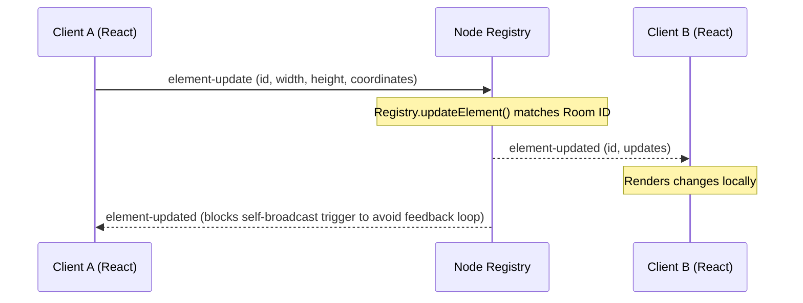
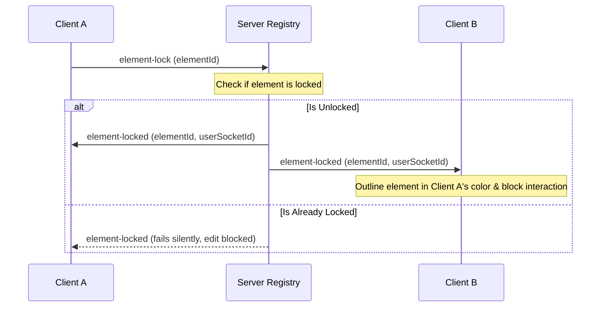
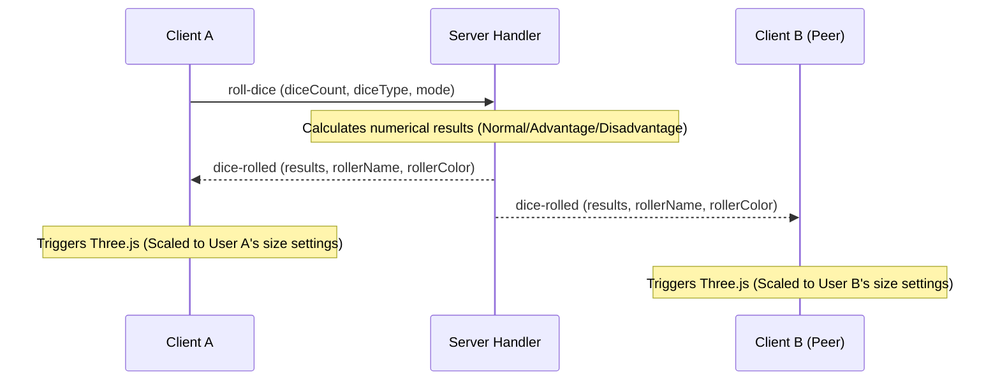

# Antigravity Canvas: Real-Time Multi-User Collaborative Workspace

A modern, highly responsive real-time collaborative canvas built with a decoupled, modular monorepo architecture. Antigravity Canvas enables users to join rooms, collaboratively create, transform (drag, scale, rotate), and delete vector shapes or custom image assets, draw with custom-configured freehand brushes and erasers, roll RPG dice with interactive 3D WebGL physics simulations, and manage multiple workspaces via collaborative tabs. Concurrency is governed by a robust, real-time lock-mutex mechanism to prevent collision conflicts.

---

## 🚀 Key Features

*   **Real-Time Collaborative Editing**: Instant canvas edits, transforms, and actions synchronized over WebSockets.
*   **Decoupled Modular Architecture**: Backend handlers and frontend components are split into clear, single-responsibility files.
*   **Interactive HTML5 Canvas Viewport**: A high-DPI double-buffered rendering surface with touch gestures, panning, and pinch-to-zoom.
*   **Exclusive Mutex Concurrency Locks**: Visual bounding lock highlights using the locking user's color to prevent edit collisions.
*   **Collaborative Freehand Sketching**: Multi-user brushes with color presets, stroke weights, and split-capable erasers (5px to 100px).
*   **3D WebGL Physics Dice Roller**: Rigid-body RPG dice rolls (d4 to d100) using Three.js with customizable per-client sizing.
*   **Multi-Tab Support**: Collaborative tabs that users can create, delete, switch, or double-click to rename dynamically.
*   **User Profiles & Live Popovers**: Dynamic cursor colors, custom nickname editors, and real-time cursor pointer tags.
*   **Custom Image Uploads**: Multipart REST endpoint supporting local asset storage and placement onto the canvas board.
*   **Collapsible Drawer Panel Widgets**: Side-panels tracking active users, transform specs, tooltip attributes, and RPG roll histories.

---

## 📂 File System Map & Component Duties

Below is the directory map of the modularized monorepo. Every file is mapped to its operational duty.

```text
/realtime-canvas
  ├── .gitignore               # Root git ignore patterns (excludes node_modules & builds)
  ├── .antigravityignore       # Development ignore configurations
  ├── README.md                # Main project documentation manual
  ├── STRUCTURE.md             # Codebase architecture guidelines
  ├── ROADMAP.md               # Feature checklist and design proposals
  │
  ├── /server                  # Express + Socket.io Server (Port 5000 / 5001)
  │     ├── package.json       # Backend script dependencies
  │     ├── server.js          # Core entry point; serves production bundle & registers handlers
  │     ├── registry.js        # State registry manager (Users, Elements, Tabs, and Locks)
  │     └── /handlers          # Modular Socket event handlers
  │           ├── connectionHandler.js # Joins/disconnects users, tracks cursor delta frames
  │           ├── elementHandler.js    # Element creations, updates, selections, locks, deletions
  │           ├── tabHandler.js        # Multi-tab view ports management events
  │           └── diceHandler.js       # RPG randomizers (calculates Normal/Advantage/Disadvantage)
  │
  └── /client                  # Frontend Vite + React + Tailwind CSS v4 (Port 5173)
        ├── package.json       # Frontend script dependencies
        ├── vite.config.js     # Bundler configuration (with Tailwind CSS plugin)
        ├── index.html         # Application shell document
        └── /src
              ├── main.jsx     # Mounts React to the index DOM element
              ├── index.css    # Global styles importing Tailwind and custom scrollbars
              ├── App.jsx      # Orchestrator coordinating sockets, states, and panels
              ├── constants.js # Presets (random names, colors, background images)
              └── /components
                    ├── /canvas
                    │     ├── Canvas.jsx         # Viewport wrapper & gestures hook
                    │     ├── CanvasRenderer.js  # Pure context 2D drawing routines
                    │     └── CanvasSelection.js # Coordinate bounds and hit-detections
                    ├── /dice
                    │     ├── DiceEffects.jsx    # WebGL overlay frame tick loops
                    │     ├── DiceGeometries.js  # Mesh models mappings for RPG dice
                    │     ├── DiceMath.js        # Quaternions and vector operations
                    │     └── DiceParticles.js   # Confetti and success bursts
                    ├── /header
                    │     └── Header.jsx         # Room settings, zen toggle, and popovers
                    ├── /lobby
                    │     └── Lobby.jsx          # Welcome screen and profile initializer
                    ├── /sidebar
                    │     ├── LeftSidebar.jsx    # Drawing tools, uploads, and grids controls
                    │     ├── RightSidebar.jsx   # Collapsible sidebar layouts coordinator
                    │     ├── ActiveUsersWidget.jsx # User online lists & recolor wheels
                    │     ├── InspectorWidget.jsx   # Coordinates, constraints, and z-layers
                    │     ├── TooltipInspector.jsx  # Token attributes & hitpoints metrics
                    │     └── DiceRollerWidget.jsx  # RPG dice config bag and scale slider
                    └── /common
                          ├── DieIcon.jsx        # SVG vector outlines for RPG dice
                          └── TabButton.jsx      # Renamable tab capsules
```

### 1. Root Configuration Files
*   [README.md](file:///c:/Users/Scott%20Simenel/.gemini/antigravity/scratch/realtime-canvas/README.md) - The main documentation manual.
*   [STRUCTURE.md](file:///c:/Users/Scott%20Simenel/.gemini/antigravity/scratch/realtime-canvas/STRUCTURE.md) - Design structure rules and architectural maps.
*   [ROADMAP.md](file:///c:/Users/Scott%20Simenel/.gemini/antigravity/scratch/realtime-canvas/ROADMAP.md) - Long-term product roadmaps and technical drafts.

### 2. Backend Server Components (`/server`)
*   [server.js](file:///c:/Users/Scott%20Simenel/.gemini/antigravity/scratch/realtime-canvas/server/server.js) - Sets up Express, static client routing in production, handles image upload multipart requests via `multer` to `/api/upload`, and maps socket channels to sub-handlers.
*   [registry.js](file:///c:/Users/Scott%20Simenel/.gemini/antigravity/scratch/realtime-canvas/server/registry.js) - Manages memory transactional databases. Holds lists of active users, canvas elements, tab instances, and element locks, providing mutation methods like `recolorUser()`, `switchUserTab()`, and `disconnectUser()`.
*   [connectionHandler.js](file:///c:/Users/Scott%20Simenel/.gemini/antigravity/scratch/realtime-canvas/server/handlers/connectionHandler.js) - Handles connection/disconnection, joining rooms, throttled mouse cursor coordinates.
*   [elementHandler.js](file:///c:/Users/Scott%20Simenel/.gemini/antigravity/scratch/realtime-canvas/server/handlers/elementHandler.js) - Handles element locking, unlocking, creations, updates, position reordering, deletions.
*   [tabHandler.js](file:///c:/Users/Scott%20Simenel/.gemini/antigravity/scratch/realtime-canvas/server/handlers/tabHandler.js) - Handles multi-tab creation, switching, renaming, deletion.
*   [diceHandler.js](file:///c:/Users/Scott%20Simenel/.gemini/antigravity/scratch/realtime-canvas/server/handlers/diceHandler.js) - Handles RNG dice rolls logic, Advantage/Disadvantage calculations, and broadcasts roll updates.

### 3. Frontend Client Components (`/client/src/`)
*   [App.jsx](file:///c:/Users/Scott%20Simenel/.gemini/antigravity/scratch/realtime-canvas/client/src/App.jsx) - Main orchestrator. Controls WebSocket listeners, room sync loops, and optimistic updates. Contains the parent states for element changes and active users, preventing "input fights" when users modify elements.
*   [constants.js](file:///c:/Users/Scott%20Simenel/.gemini/antigravity/scratch/realtime-canvas/client/src/constants.js) - Configuration settings, default color presets, random name generators, and sample background image URLs.
*   [Canvas.jsx](file:///c:/Users/Scott%20Simenel/.gemini/antigravity/scratch/realtime-canvas/client/src/components/canvas/Canvas.jsx) - Viewport wrapper. Coordinates pointers, zoom ratios, pan offsets, double buffers, and multi-touch gestures.
*   [CanvasRenderer.js](file:///c:/Users/Scott%20Simenel/.gemini/antigravity/scratch/realtime-canvas/client/src/components/canvas/CanvasRenderer.js) - Decoupled pure canvas rendering logic. Paints grid systems, bounding selections, user cursor names, shapes, and active lock limits.
*   [CanvasSelection.js](file:///c:/Users/Scott%20Simenel/.gemini/antigravity/scratch/realtime-canvas/client/src/components/canvas/CanvasSelection.js) - Coordinate systems conversions (e.g., handles rotated canvas bounding boxes, scaling anchor offsets).
*   [DiceEffects.jsx](file:///c:/Users/Scott%20Simenel/.gemini/antigravity/scratch/realtime-canvas/client/src/components/dice/DiceEffects.jsx) - WebGL canvas using Three.js to run 3D dice physics animations. Integrates size settings that scale meshes independently per client.
*   [DiceGeometries.js](file:///c:/Users/Scott%20Simenel/.gemini/antigravity/scratch/realtime-canvas/client/src/components/dice/DiceGeometries.js) - Buffer coordinates representing vertices and faces of standard RPG polyhedrals (d4, d6, d8, d10, d12, d20, d100).
*   [DiceMath.js](file:///c:/Users/Scott%20Simenel/.gemini/antigravity/scratch/realtime-canvas/client/src/components/dice/DiceMath.js) - Vector transformations and quaternion interpolations (`qLerp`) for rotation.
*   [DiceParticles.js](file:///c:/Users/Scott%20Simenel/.gemini/antigravity/scratch/realtime-canvas/client/src/components/dice/DiceParticles.js) - Overlay animations for dice successes, spark rings, and ashes.
*   [Header.jsx](file:///c:/Users/Scott%20Simenel/.gemini/antigravity/scratch/realtime-canvas/client/src/components/header/Header.jsx) - Top control bar displaying room IDs, sync states, zen toggler, profile name/color editor, and the online active members popover card.
*   [Lobby.jsx](file:///c:/Users/Scott%20Simenel/.gemini/antigravity/scratch/realtime-canvas/client/src/components/lobby/Lobby.jsx) - Interactive portal to input room IDs and names, and choose initial colors.
*   [LeftSidebar.jsx](file:///c:/Users/Scott%20Simenel/.gemini/antigravity/scratch/realtime-canvas/client/src/components/sidebar/LeftSidebar.jsx) - Canvas tools sidebar: add rectangle/circle/textbox shapes, upload custom pictures, adjust grid sizes, toggles gridlines visibility.
*   [RightSidebar.jsx](file:///c:/Users/Scott%20Simenel/.gemini/antigravity/scratch/realtime-canvas/client/src/components/sidebar/RightSidebar.jsx) - Right panels coordinator, housing active lists, inspectors, and dice bag tabs.
*   [ActiveUsersWidget.jsx](file:///c:/Users/Scott%20Simenel/.gemini/antigravity/scratch/realtime-canvas/client/src/components/sidebar/ActiveUsersWidget.jsx) - Real-time participant tracker showing online status, active tabs, and inline custom user color recoloring triggers.
*   [InspectorWidget.jsx](file:///c:/Users/Scott%20Simenel/.gemini/antigravity/scratch/realtime-canvas/client/src/components/sidebar/InspectorWidget.jsx) - Numerical position properties inputs (x, y, w, h, rotation angle), lock overrides, and layer reordering buttons.
*   [TooltipInspector.jsx](file:///c:/Users/Scott%20Simenel/.gemini/antigravity/scratch/realtime-canvas/client/src/components/sidebar/TooltipInspector.jsx) - Renders RPG token features, dynamic HP level overlays, and character status cards.
*   [DiceRollerWidget.jsx](file:///c:/Users/Scott%20Simenel/.gemini/antigravity/scratch/realtime-canvas/client/src/components/sidebar/DiceRollerWidget.jsx) - RPG controller to select rolls (Normal, Advantage, Disadvantage), configure dice pools, slider to adjust individual 3D scale configurations, and logs history of rolls.
*   [DieIcon.jsx](file:///c:/Users/Scott%20Simenel/.gemini/antigravity/scratch/realtime-canvas/client/src/components/common/DieIcon.jsx) - SVG components for RPG polyhedral models.
*   [TabButton.jsx](file:///c:/Users/Scott%20Simenel/.gemini/antigravity/scratch/realtime-canvas/client/src/components/common/TabButton.jsx) - Tabs capsules handling double-click renaming, custom delete controls, and inline active user indicators.

---

## 🔄 Core System Interactions & Data Flow

### 1. WebSockets Synchronization Lifecycle
The application coordinates state synchronization via real-time WebSockets powered by Socket.io.



1.  **Throttling**: Mouse movements (`cursor-move`) are throttled to a **30ms interval** on the client before being sent.
2.  **Self-Broadcast Filtering**: To prevent input bouncing and cursor lag, events sent from a socket are broadcast to everyone *except* the sender (using `socket.to(room).emit`), as the sender has already rendered the change locally.

### 2. Exclusive Selection Locking (Mutex)
To avoid concurrent modifications to the same element, a client must request a lock before editing.



*   **Lock Release**: Bounding box handle releases trigger `element-unlock`, clearing the lock for all room members.
*   **Automatic Cleanup**: If a user disconnects, the server automatically scans and releases any locks held by that user.

### 3. WebGL 3D Physics Dice Overlay
When a user rolls a die, the calculations are synchronized, but the visual simulation scales to the client's preferred settings.



*   **Frame-Rate Decoupling**: The physics loop inside [DiceEffects.jsx](file:///c:/Users/Scott%20Simenel/.gemini/antigravity/scratch/realtime-canvas/client/src/components/dice/DiceEffects.jsx) calculates velocities using delta time ($dt$). This ensures consistent animation speeds on both 60Hz and 144Hz monitors.
*   **Scale Settings**: A size slider inside [DiceRollerWidget.jsx](file:///c:/Users/Scott%20Simenel/.gemini/antigravity/scratch/realtime-canvas/client/src/components/sidebar/DiceRollerWidget.jsx) modifies a local scale multiplier. When a peer rolls, the local client's simulation displays the dice at the local user's preferred scale.

---

## ⚙️ Core Mathematics & Geometry

### 1. Rotated Coordinate Conversion
Click hit detection on elements rotated by an angle $\theta$ (in radians) is calculated by translating coordinates into the local coordinate system of the element and rotating by $-\theta$:

$$\begin{bmatrix} x_{\text{local}} \\ y_{\text{local}} \end{bmatrix} = \begin{bmatrix} \cos(-\theta) & -\sin(-\theta) \\ \sin(-\theta) & \cos(-\theta) \end{bmatrix} \begin{bmatrix} x_{\text{click}} - x_{\text{center}} \\ y_{\text{click}} - y_{\text{center}} \end{bmatrix}$$

These calculations are located in [CanvasSelection.js](file:///c:/Users/Scott%20Simenel/.gemini/antigravity/scratch/realtime-canvas/client/src/components/canvas/CanvasSelection.js).

### 2. High-DPI Canvas Rendering
The canvas uses `devicePixelRatio` to prevent blurry rendering on high-resolution screens:

```javascript
const rect = canvas.getBoundingClientRect();
canvas.width = rect.width * window.devicePixelRatio;
canvas.height = rect.height * window.devicePixelRatio;
ctx.scale(window.devicePixelRatio, window.devicePixelRatio);
```

This adjustments loop runs within [Canvas.jsx](file:///c:/Users/Scott%20Simenel/.gemini/antigravity/scratch/realtime-canvas/client/src/components/canvas/Canvas.jsx).

---

## 🚀 Running the Application Locally

Follow the setup instructions below based on your operating system:

---

### Option A: Windows & Generic Environments

The server runs on port `5000` by default.

#### 1. Start the Backend Server (Port 5000)
Open a terminal in the root directory:
```bash
cd server
npm install
npm run dev
```
The server will start at `http://localhost:5000`. You can check the health status endpoint at `http://localhost:5000/health`.

#### 2. Start the Frontend Client (Port 5173)
Open a second terminal window in the root directory:
```bash
cd client
npm install
npm run dev
```
The client runs at `http://localhost:5173`. Vite routes WebSocket traffic to the server on port `5000` by default.

---

### Option B: macOS Environment (Handling AirPlay Port Conflict)

On macOS Monterey and newer, the system **AirPlay Receiver** binds to port `5000` by default. To prevent `EADDRINUSE` conflicts, run the server on port `5001` or disable AirPlay Receiver.

#### 1. Setup Shell Variables (Apple Silicon M-Series)
If Homebrew is installed but not globally loaded:
```bash
echo 'eval "$(/opt/homebrew/bin/brew shellenv)"' >> ~/.zprofile
eval "$(/opt/homebrew/bin/brew shellenv)"
brew install node cloudflared
```

#### 2. Start the Backend Server (Port 5001)
Open a new terminal window:
```bash
cd server
npm install
PORT=5001 npm run dev
```
The server starts at `http://localhost:5001`.

#### 3. Start the Frontend Client (Port 5173)
Open a second terminal window:
```bash
cd client
npm install
npm run dev
```
Note: You can turn off AirPlay Receiver in **System Settings -> General -> AirDrop & Handoff -> toggle off "AirPlay Receiver"** to allow the client to connect via the default port `5000`.

---

## 📦 Production Builds & Deployment

In production, the application is served from a single port. The Express backend serves the compiled React client static files directly, avoiding CORS and multi-origin connection routing.

### 1. Build and Run Statically

#### Compile and Start (Windows/Linux - Port 5000):
```bash
# 1. Compile the React client assets
cd client
npm run build

# 2. Start the Express server
cd ../server
npm run start
```

#### Compile and Start (macOS - Port 5001):
```bash
# 1. Compile the React client assets
cd client
npm run build

# 2. Start the Express server on port 5001
cd ../server
PORT=5001 npm run start
```
Static bundle serving paths are loaded automatically from `/client/dist` inside [server.js](file:///c:/Users/Scott%20Simenel/.gemini/antigravity/scratch/realtime-canvas/server/server.js).

---

### 2. Expose via Cloudflare Tunnels (Zero Trust)

A Cloudflare Tunnel allows you to expose your local production server to the internet securely without port forwarding.

#### Quick Tunnels (No Account Needed, Temporary URL)
Ensure `cloudflared` is installed and run:

*   **Windows & Linux**:
    ```bash
    cloudflared tunnel --url http://localhost:5000
    ```
*   **macOS**:
    ```bash
    cloudflared tunnel --url http://localhost:5001 --protocol http2
    ```
*(Note: `--protocol http2` works around QUIC UDP block issues on restricted networks).*

Copy and share the temporary `https://*.trycloudflare.com` URL printed in the logs.

#### Persistent Subdomain Tunnels (Requires Cloudflare-Managed Domain)
1.  **Login**:
    ```bash
    cloudflared tunnel login
    ```
2.  **Create a Tunnel**:
    ```bash
    cloudflared tunnel create canvas-tunnel
    ```
3.  **Configure**: Create `~/.cloudflared/config.yml`:
    ```yaml
    tunnel: <TUNNEL_ID>
    credentials-file: <PATH_TO_CREDENTIALS_JSON>
    protocol: http2
    ingress:
      - hostname: canvas.yourdomain.com
        service: http://localhost:5000 # change to 5001 for macOS
      - service: http_status:404
    ```
4.  **Route Domain**:
    ```bash
    cloudflared tunnel route dns canvas-tunnel canvas.yourdomain.com
    ```
5.  **Run**:
    ```bash
    cloudflared tunnel run canvas-tunnel
    ```

---

## 🛠️ Long-Term Maintenance & Development Guidelines

To ensure the codebase remains maintainable for both developers and AI assistants, observe the following rules:

### 1. Maintain Decoupled Math and Views
*   Keep React components focused on rendering and UI states.
*   Put calculations (such as hitboxes, scaling offsets, and rotation quaternions) in pure JavaScript modules (e.g., [CanvasSelection.js](file:///c:/Users/Scott%20Simenel/.gemini/antigravity/scratch/realtime-canvas/client/src/components/canvas/CanvasSelection.js) or [DiceMath.js](file:///c:/Users/Scott%20Simenel/.gemini/antigravity/scratch/realtime-canvas/client/src/components/dice/DiceMath.js)).
*   Write math as testable pure functions:
    ```javascript
    export function getCenterRotatedPoint(pointX, pointY, centerX, centerY, angleRadians) { ... }
    ```

### 2. Follow State Syncing & Concurrency Lock Rules
*   **Optimistic Sync Flow**:
    1.  Apply changes to the local React state immediately for responsive feedback.
    2.  Emit the corresponding change event over the socket connection.
    3.  Exclude the sender in server socket broadcasts (using `socket.to(room).emit`) to prevent cursor jitter or input jumping.
*   **Locked Elements Prevention**: Make sure components check the lock state before rendering edit panels. If another user holds a lock on an element, the properties inputs must be read-only.

### 3. Tailwind CSS v4 Styling Conventions
*   Avoid adding rules to [index.css](file:///c:/Users/Scott%20Simenel/.gemini/antigravity/client/src/index.css) unless they are global resets or scrollbar adjustments.
*   Use inline Tailwind utility classes inside React JSX elements.
*   Tailwind v4 features are configured directly inside [vite.config.js](file:///c:/Users/Scott%20Simenel/.gemini/antigravity/scratch/realtime-canvas/client/vite.config.js).

### 4. Prevent Memory Leaks
*   **Socket Event Receivers**: Always unregister socket event listeners when components unmount to prevent duplicate triggers:
    ```javascript
    useEffect(() => {
      socket.on('element-updated', handleUpdate);
      return () => {
        socket.off('element-updated', handleUpdate);
      };
    }, [socket]);
    ```
*   **Tick loops in Canvas/WebGL**: In [DiceEffects.jsx](file:///c:/Users/Scott%20Simenel/.gemini/antigravity/scratch/realtime-canvas/client/src/components/dice/DiceEffects.jsx), ensure `requestAnimationFrame` is cancelled and Three.js geometries/materials are disposed of on component unmount.
