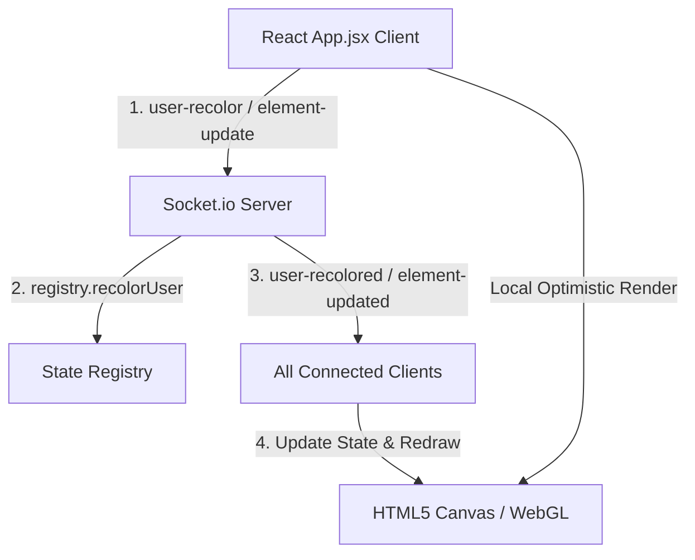

# Codebase Architecture & Structure Guide

This document maps out the modularized architecture of the Antigravity Canvas real-time collaborative workspace. It serves as a contract for developers and AI coding agents, detailing where code lives, how state flows, and the design patterns used throughout the project.

---

## 🏗️ Architecture Overview

The application is structured as a decoupled monorepo containing:
1.  **`/server`**: A lightweight Node.js + Express + Socket.io server managing transactional room state, element locking (mutexes), and collaborative dice rolls.
2.  **`/client`**: A Vite-powered React client utilizing a High-DPI HTML5 `<canvas>` for element rendering and WebGL (Three.js) for 3D physics dice roll animations.

### Data Flow Pipeline


---

## 📂 File System Map & Component Duties

### 1. Root Configurations
*   [README.md](file:///c:/Users/Scott%20Simenel/.gemini/antigravity/scratch/realtime-canvas/README.md): Operational guide detailing local startup commands, build steps, and production self-hosting via Cloudflare Tunnels.
*   [ROADMAP.md](file:///c:/Users/Scott%20Simenel/.gemini/antigravity/scratch/realtime-canvas/ROADMAP.md): Product features planner and event schemas specifications.
*   [STRUCTURE.md](file:///c:/Users/Scott%20Simenel/.gemini/antigravity/scratch/realtime-canvas/STRUCTURE.md): This architectural guide.
*   [shared/protocol.js](file:///c:/Users/Scott%20Simenel/.gemini/antigravity/scratch/realtime-canvas/shared/protocol.js): Standardized event strings and payload protocols used between client and server.

### 2. Backend Server (`/server`)
*   [server.js](file:///c:/Users/Scott%20Simenel/.gemini/antigravity/scratch/realtime-canvas/server/server.js): Entry point that instantiates the Express application, serving compiled client files in production, setting up the `/api/upload` endpoint, and routing incoming socket connections to sub-event handlers.
*   [registry.js](file:///c:/Users/Scott%20Simenel/.gemini/antigravity/scratch/realtime-canvas/server/registry.js): The in-memory transactional database. Houses lists of active users, canvas elements, tab instances, and element locks, providing mutation methods like `recolorUser()`, `switchUserTab()`, and `disconnectUser()`.
*   `/server/handlers/`:
    *   `connectionHandler.js`: Manages socket connections, room creation/joining (`join-room`), throttled real-time cursor updates (`cursor-move`), and disconnection cleanup routines.
    *   `elementHandler.js`: Manages element manipulation events: locking (`element-lock`), unlocking (`element-unlock`), spawning new shapes/images (`element-create`), moving/scaling/rotating (`element-update` / `elements-reorder`), and deleting elements (`element-delete`).
    *   `tabHandler.js`: Manages multi-tab operations: creating tabs (`tab-create`), deleting tabs (`tab-delete`), renaming (`tab-rename`), and switching active viewports (`tab-switch`).
    *   `diceHandler.js`: Handles backend RPG dice rolls. Receives dice count, type, and roll mode (Normal, Advantage, Disadvantage), calculates values, and broadcasts the resolved payload.

### 3. Frontend Client (`/client`)
*   `App.jsx`: The layout orchestrator. Manages parent React state bindings, establishes Socket.io event receivers, handles optimistic local merges, and arranges the grid panels.
*   `constants.js`: Holds application config tokens (preset colors, default sidebar items, sample background images).
*   `/client/src/lib/`: Custom utility libraries.
    *   `socket.js`: Lazy socket resolver and URL setup.
    *   `url.js`: Normalizes path variables to absolute socket asset URLs.
    *   `locks.js`: Maps raw array lock logs `[eId, uId][]` to index maps `{[eId]: uId}`.
    *   `ids.js`: Handles element, tab, asset, and roll ID template generation.
    *   `mergeElement.js`: Standardizes deep element and properties updates merging.
*   `/client/src/state/`: Modular context stores mapping states.
    *   `uiStore.js`: Layout panel visibility state triggers and toggles.
    *   `diceStore.js`: Mixed dice roller bag totals, animations data, and roll triggers.
    *   `canvasStore.js`: Collaborative tabs, elements, locks, and room settings state.
    *   `selectionStore.js`: Selected elements, inspector focus, and dimension inputs.
    *   `historyStore.js`: Undo/redo stacks and history push actions.
    *   `clipboardStore.js`: Copy, cut, and paste element operations.
    *   `uploadStore.js`: Assets registry, hidden assets, and upload progress/errors.
*   `/client/src/app/`: Layout providers and custom state hooks.
    *   `AppProviders.jsx`: Root provider chaining all state contexts (Ui -> Dice -> Upload -> Canvas -> Selection -> History -> Clipboard).
    *   `hooks/`:
        *   `useDiceTick.js`: Sets up a 60ms ticker for dice tumble animations.
        *   `useZenModeShortcut.js`: Registers the keydown keyboard shortcut `\` for Zen Mode.
        *   `useKeyboardShortcuts.js`: Registers undo, redo, copy, cut, and paste global key commands.
        *   `useTabs.js`: Collaborative tab CRUD triggers.
        *   `useElementActions.js`: Spawning shapes/images, reordering layers, and drag-and-drop helpers.
        *   `useSelectionActions.js`: Element selection, transformations, deletions, and lock toggles.
        *   `useSocketConnection.js`: Socket connection state and automatic room rejoin handler.
        *   `useUserEvents.js`: Listens to user join/leave, renaming, recoloring, and cursor movements.
        *   `useElementEvents.js`: Listens to element locks, creates, updates, and deletes.
        *   `useTabEvents.js`: Listens to tab creation, deletion, and renaming.
        *   `useDiceEvents.js`: Listens to dice roll broadcasts.
        *   `useSaveEvents.js`: Listens to room state loading and handles save CRUD requests.
*   `/client/src/components/common/`:
    *   `DieIcon.jsx`: Renders scalable vector SVG representations for d4, d6, d8, d10, d12, d20, and d100 dice shapes.
    *   `TabButton.jsx`: Render tab capsules in the workspace header supporting double-click renaming, custom delete controls, and inline active user indicators.
*   `/client/src/components/lobby/`:
    *   `Lobby.jsx`: The welcome page. Gathers user name input, handles cursor color presets, collects target Room IDs, and runs verification checks before joining a workspace.
*   `/client/src/components/header/`:
    *   `Header.jsx`: Top control bar displaying room IDs, syncing status indicators, a Zen Mode toggle, profile capsule (with name and color picker editor), and the active room participants popover card.
*   `/client/src/components/sidebar/`:
    *   `LeftSidebar.jsx`: Spawns shapes (rectangle, circle, text), handles image uploads, manages canvas background settings (grid toggle, size, and background images).
    *   `RightSidebar.jsx`: Hosts collapsible drawers for active list items:
        *   `ActiveUsersWidget.jsx`: Displays room members, their cursor colors (with custom recolor selectors), and their active tabs.
        *   `InspectorWidget.jsx`: Hosts position and dimension overrides, lock elements toggles, layer ordering.
        *   `TooltipInspector.jsx`: HP numeric bars tracker, attribute stat grids editor.
        *   `DiceRollerWidget.jsx`: RPG dice bag and live rolls log.
*   `/client/src/components/canvas/`:
    *   `Canvas.jsx`: Core viewport wrapper. Tracks mouse/pointer event listeners, keydown presses, viewport scales, pan offsets, and pinch-to-zoom multi-touch gestures.
    *   `CanvasRenderer.js`: Pure functions containing HTML5 2D Canvas context rendering steps (`drawGrid`, `drawShapes`, `drawSelectionFrame`, `drawCursorTags`).
    *   `CanvasSelection.js`: Pure hit-detection and vector math functions (rotated coordinate translations, corner scale handle detection).
*   `/client/src/components/dice/`:
    *   `DiceEffects.jsx`: WebGL Three.js overlay initializer. Manages perspective projection setups, mesh lists, and runs the animation loop using high-precision frame rate decoupled delta time (`dt`).
    *   `DiceMath.js`: Pure quaternion mathematics modules (multiplication, normalization, interpolation `qLerp`, rotation calculations).
    *   `DiceGeometries.js`: Vertices mapping coordinates, face list mappings, and buffer geometry builders.
    *   `DiceParticles.js`: 2D canvas effects overlay rendering sparks, celebration confetti, critical success indicators, and ash clouds.

---

## 🤖 Guidelines for AI-Driven Development

To optimize changes made by AI assistants, follow these structured guidelines:

1.  **Keep Logic Decoupled from Views**:
    *   Never put coordinate transformation logic or matrix multiplications directly inside components. Put them in `/canvas/CanvasSelection.js` or `/dice/DiceMath.js`.
    *   Implement math as pure functions that can be tested in isolation (i.e. `const rotatedPoint = getRotatedPoint(x, y, cx, cy, angle)`).
2.  **Use TypeScript-like JSDoc Contracts**:
    *   Every new React component or logic function must feature clean JSDoc descriptors defining inputs and parameters:
    ```javascript
    /**
     * Translates coordinates to match current viewport pan and zoom scales.
     * @param {number} clientX - Source browser pointer X coordinate.
     * @param {number} clientY - Source browser pointer Y coordinate.
     * @param {Object} pan - Current pan offsets.
     * @param {number} zoom - Viewport scale ratio.
     * @returns {{x: number, y: number}} Localized coordinates.
     */
    ```
3.  **Strict Local State Isolation (Optimistic Updates)**:
    *   When adding collaborative actions (e.g. updating settings, elements, or details):
        1. Perform local React state modifications immediately (optimistic update).
        2. Emit the event over `socketRef.current`.
        3. Block self-broadcast messages in socket listeners to prevent cursor bouncing and input fight during active typing/dragging.
