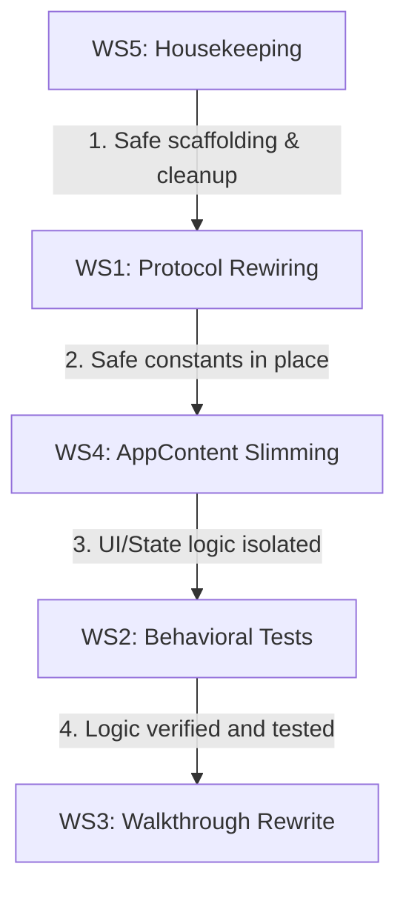

# Remediation Plan Analysis — Gaps & Roadmap

This document analyzes the proposed [REMEDIATION_PLAN.md](file:///c:/Users/Scott%20Simenel/.gemini/antigravity/scratch/realtime-canvas/REMEDIATION_PLAN.md) in detail. It cross-checks the stated gaps with the current codebase, highlights specific violations of the `agent.md` guidelines, and details the steps required to achieve 100% compliance.

---

## 🔍 Gap Assessment & Codebase Verification

Based on a detailed check of the active workspace, here is the validation of the 5 gaps:

### 1. Gap G1: Hardcoded Socket Event Strings (🔴 High Severity)
* **Rule Violated**: `agent.md` §Arch 5 **"Shared Socket Protocol as the Single Source of Truth" [BLOCKING]**.
* **Stated Count**: 18 hardcoded socket strings.
* **Codebase Verification**: 
  - Verified **17 strings** in [Canvas.jsx](file:///c:/Users/Scott%20Simenel/.gemini/antigravity/scratch/realtime-canvas/client/src/components/canvas/Canvas.jsx):
    - `cursor-move` (L344)
    - `element-delete` (L373, L728, L970)
    - `element-unlock` (L449, L456, L1386, L1416)
    - `element-create` (L730, L972, L1305)
    - `element-lock` (L762, L806, L857, L886)
    - `element-update` (L1234, L1237)
  - Verified **1 string** in [RightSidebar.jsx](file:///c:/Users/Scott%20Simenel/.gemini/antigravity/scratch/realtime-canvas/client/src/components/sidebar/RightSidebar.jsx):
    - `element-delete` (L212)
* **Risk**: High risk of protocol drift. A change in `/shared/protocol.js` or server handlers will silently break client emissions if views are not updated.
* **Remediation**: Import `EVENTS` from `shared/protocol.js` and rewire all 18 occurrences.

### 2. Gap G2: Existence-Only Unit Tests (🔴 High Severity)
* **Rule Violated**: `agent.md` §Workflows 3 **"Verification Loop" [BLOCKING]** (intent to prove code correctness).
* **Stated Count**: 20 out of 28 tests check definition status only (`expect(X).toBeDefined()`).
* **Codebase Verification**: Verified in [stores.test.js](file:///c:/Users/Scott%20Simenel/.gemini/antigravity/scratch/realtime-canvas/client/src/state/__tests/stores.test.js). Trivial assertions check if providers and hooks load, but assert nothing about their behavior.
* **Risk**: High risk of regression. Critical features like history stacks, clipboard offsets, layer arrangements, coordinate bounds calculation, and rotation calculations are completely unverified.
* **Remediation**: 
  - Delete definition-only tests.
  - Implement full behavioral tests for pure math functions (`CanvasSelection.js`, `DiceMath.js`) and store logic (`historyStore` undo/redo transactions, `clipboardStore` offsets and ID generation, `canvasStore` tab isolations).
  - Target coverage: **≥70% statements / ≥60% branches** on state and math modules.

### 3. Gap G3: Stale & Inaccurate Walkthrough (🟡 Medium Severity)
* **Rule Violated**: `agent.md` §Guardrails 5 **"Preserve the Verification Audit Trail"**.
* **Problem**: The walkthrough re-pastes old work, claims incorrect line count metrics (claims 4,200 → 600 lines, actual is 2,750 → 134), and omits existing issues.
* **Remediation**: Restructure [walkthrough.md](file:///c:/Users/Scott%20Simenel/.gemini/antigravity/scratch/realtime-canvas/.agents/walkthrough.md), move historical work to a distinct section, and accurately log line counts and remediation verification data.

### 4. Gap G4: AppContent.jsx Megacomponent (🟡 Medium Severity)
* **Rule Violated**: `agent.md` §Arch 6 **"Protect the Architecture Boundaries" [BLOCKING]**.
* **Problem**: At **1,165 lines**, [AppContent.jsx](file:///c:/Users/Scott%20Simenel/.gemini/antigravity/scratch/realtime-canvas/client/src/app/AppContent.jsx) is a massive file holding 7 state variables and 7 refs.
* **Risk**: High cognitive load, high context-window usage, and difficult to test.
* **Remediation**: Slim the file to **< 500 lines** by moving tool configurations, active tools, canvas-preference states, and selection transform refs into `uiStore` and `selectionStore`.

### 5. Gap G5: Housekeeping & Self-Edits (🟢 Low Severity)
* **Problem**: Guidelines (`agent.md`) were self-edited without top-level changelogs.
* **Remediation**: Document rules history at the top of `agent.md`, and verify `STRUCTURE.md` completeness.

---

## 🛠️ Workstream Execution Plan

To remediate these gaps systematically, we will execute the five workstreams in the recommended safe order:



### WS5: Housekeeping
* **Tasks**:
  1. Add the changelog reference at the top of the Workflows section in [agent.md](file:///c:/Users/Scott%20Simenel/.gemini/antigravity/scratch/realtime-canvas/agent.md).
  2. Cross-check [STRUCTURE.md](file:///c:/Users/Scott%20Simenel/.gemini/antigravity/scratch/realtime-canvas/STRUCTURE.md) for 100% file coverage.
* **Git Commit**: `Housekeeping: Remove stray files, update gitignore, and document guidelines edit history`

### WS1: Protocol Rewiring
* **Tasks**:
  1. Import `EVENTS` from `../../../shared/protocol.js` inside `Canvas.jsx` and `RightSidebar.jsx`.
  2. Swap all 18 occurrences of hardcoded event strings.
  3. Run the verification script:
     ```bash
     git grep -nE "socket\.(emit|on|off)\(['\"][a-z-]+['\"]" client/src/ | grep -v shared/protocol.js | wc -l
     ```
     *(Target output: 0)*
  4. Perform two-browser tab smoke-tests for cursor sync, locks, transforms, deletes, and eraser splits.
* **Git Commit**: `Refactor Stage 7.5: Rewire remaining 18 hardcoded socket event strings to shared/protocol.js`

### WS4: AppContent Slimming
* **Tasks**:
  1. Move tool states (`activeTool`, `penColor`, `penSize`, `eraserSize`) to `uiStore.js`.
  2. Move canvas-preference states (`showCursorNames`, `activeVirtualDimensions`, `showSavesModal`) to `uiStore.js`.
  3. Move selection transform refs (`inspectorLockRef`, `originalInspectorElementsRef`) to `selectionStore.js`.
  4. Verify if `activeTabIdRef` can be replaced directly with `canvasStore.activeTabId`.
  5. Run build and lint checks after each step to verify zero breakages.
* **Git Commit**: `Refactor Stage 8: Slim AppContent.jsx by delegating UI/Transform states and refs to stores`

### WS2: Behavioral Tests
* **Tasks**:
  1. Delete the 20 definition assertions.
  2. Write math logic unit tests for polygon hit-testing and coordinate math (`CanvasSelection.test.js`, `DiceMath.test.js`).
  3. Write store reducer tests for state transitions (`historyStore.test.js`, `clipboardStore.test.js`, `canvasStore.test.js`).
  4. Validate coverage reports:
     ```bash
     npm --prefix client run test -- --coverage
     ```
     *(Target: ≥70% statements / ≥60% branches)*
* **Git Commit**: `Test: Replace existence assertions with comprehensive behavioral unit tests`

### WS3: Walkthrough Rewrite
* **Tasks**:
  1. Restructure walkthrough to separate legacy 2024 work from 2026 refactoring stages.
  2. Update all line counts with exact figures.
  3. Document the remediation changes along with test results, coverage tables, and terminal verify logs.
* **Git Commit**: `Docs: Rewrite walkthrough.md to reflect final state and verification results`

---

## 🚦 Ready for Proceed Approval
This analysis is complete. The gaps are verified and the execution plan is structured. 

Once approved, we will create the task list (`task.md`) and begin with **WS5 (Housekeeping)**, committing and validating each workstream boundary.
